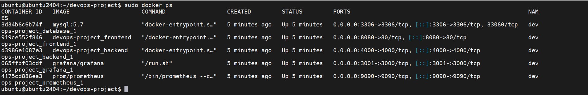
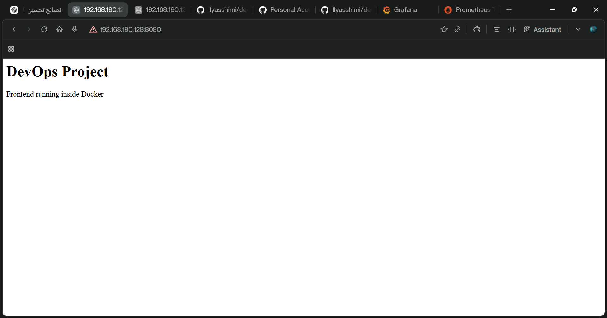
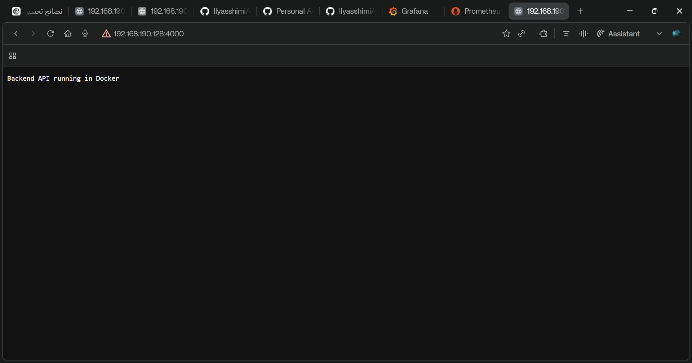
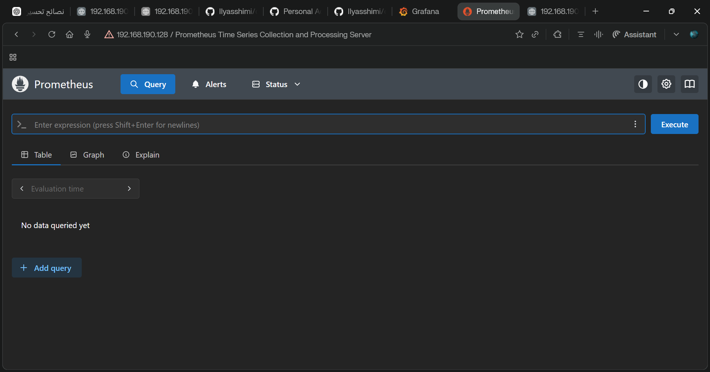
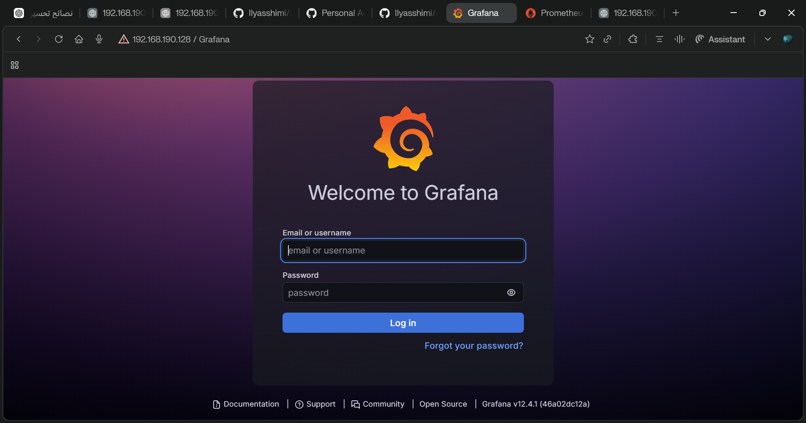

# DevOps Microservices Project (Docker)

## Overview

This project shows a simple DevOps architecture using containers.

The system runs multiple services with Docker Compose:

* Frontend (NGINX)
* Backend API (Node.js)
* Database (MySQL)
* Monitoring (Prometheus + Grafana)

All services run in containers using Docker.

---

## Architecture

User → Frontend → Backend API → MySQL

Monitoring stack:

Prometheus → Metrics
Grafana → Dashboards

---

## Technologies Used

* Docker
* Docker Compose
* NGINX
* Node.js
* MySQL
* Prometheus
* Grafana

---

## Project Structure

```
devops-project/
│
├── frontend/
│   ├── Dockerfile
│   └── index.html
│
├── backend/
│   ├── Dockerfile
│   └── server.js
│
├── docker-compose.yml
├── README.md
└── screenshots/
```

---

## Services and Ports

| Service     | Port |
| ----------- | ---- |
| Frontend    | 8080 |
| Backend API | 4000 |
| MySQL       | 3306 |
| Prometheus  | 9090 |
| Grafana     | 3001 |

---

## Run the Project

Start the services:

```
docker-compose up -d
```

Check running containers:

```
docker ps
```

Stop the services:

```
docker-compose down
```

---

## Access the Application

Frontend:

```
http://SERVER_IP:8080
```

Backend API:

```
http://SERVER_IP:4000
```

Prometheus:

```
http://SERVER_IP:9090
```

Grafana:

```
http://SERVER_IP:3001
```

Default Grafana login:

```
username: admin
password: admin
```

---

## Screenshots

### Containers Running



### Frontend



### Backend API



### Prometheus Monitoring



### Grafana Dashboard



---

## Author

DevOps learning project.

Built using Docker and microservices architecture.
